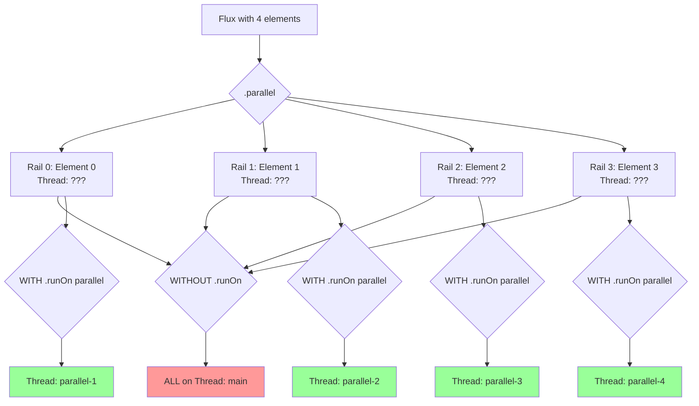

# План реализации: Демонстрация `.parallel()` и `.runOn(Schedulers.parallel())`

## Обзор

Создание сервиса для демонстрации параллельной обработки в Project Reactor 3.8.3 с тестами, использующими `reactor-test`.

**АКЦЕНТ:** Максимально детальное логирование для визуализации работы потоков!

## Реальные сценарии использования `.parallel()`

Согласно документации Reactor и книгам (например, "Reactive Programming with RxJava", "Hands-On Reactive Programming in Spring 5"), параллелизация имеет смысл для:

### 1. **CPU-bound операции** (выбран для демонстрации)
   - Обработка изображений (resize, фильтры, конвертация форматов)
   - Хеширование/шифрование данных
   - Сложные математические вычисления
   - Парсинг больших XML/JSON документов

### 2. **I/O-bound операции**
   - Параллельные вызовы к внешним REST API
   - Одновременная загрузка файлов
   - Множественные запросы к разным базам данных

### 3. **Batch-обработка**
   - Валидация множества записей
   - Трансформация коллекций данных
   - Массовая отправка уведомлений

## Архитектура реализации

### Файл: `ParallelProcessingService.java`

```
src/main/java/com/example/reactordemo/service/ParallelProcessingService.java
```

#### Методы сервиса:

1. **`processSequentially(Flux<ImageData> images)`**
   - Обычная последовательная обработка
   - Для сравнения с параллельной версией
   - **Логирование**: имя потока на КАЖДОМ шаге
   
2. **`processWithParallelOnly(Flux<ImageData> images)`**
   - Использование `.parallel()` БЕЗ `.runOn()`
   - Демонстрирует разделение на "рельсы" (rails)
   - Но выполняется на том же потоке
   - **Логирование**: показать, что поток один и тот же
   
3. **`processWithParallelAndRunOn(Flux<ImageData> images)`**
   - Использование `.parallel().runOn(Schedulers.parallel())`
   - НАСТОЯЩАЯ параллельная обработка на разных потоках
   - Каждый рельс выполняется на своем потоке из пула
   - **Логирование**: показать разные потоки (parallel-1, parallel-2, ...)

4. **`processLargeDataset(int itemCount)`**
   - Обработка большего количества элементов
   - Для измерения производительности
   - **Логирование**: статистика использованных потоков

#### Вспомогательный класс: `ImageData`

```java
public record ImageData(
    String filename,
    int width,
    int height,
    String format
) {
    public ImageData processImage() {
        // Имитация тяжелой операции (resize, filter)
        try {
            Thread.sleep(500); // 500ms на обработку
        } catch (InterruptedException e) {
            Thread.currentThread().interrupt();
        }
        return new ImageData(
            filename + "_processed",
            width / 2,
            height / 2,
            format
        );
    }
}
```

### Файл: `ParallelProcessingServiceTest.java`

```
src/test/java/com/example/reactordemo/service/ParallelProcessingServiceTest.java
```

#### Тестовые методы:

1. **`testSequentialProcessing()`**
   - Проверка последовательной обработки
   - Использование `StepVerifier`
   - Проверка порядка элементов
   - Измерение времени выполнения
   - **Сбор статистики по потокам**

2. **`testParallelWithoutRunOn()`**
   - Демонстрация `.parallel()` без `.runOn()`
   - Проверка имен потоков (должны совпадать)
   - Все еще последовательное выполнение
   - **Вывод: "Все элементы обработаны на потоке: XXX"**

3. **`testParallelWithRunOn()`**
   - Демонстрация `.parallel().runOn(Schedulers.parallel())`
   - Проверка разных имен потоков (parallel-1, parallel-2, ...)
   - Параллельное выполнение
   - Измерение времени (должно быть быстрее)
   - **Вывод: "Использовано N уникальных потоков: [parallel-1, parallel-2, ...]"**

4. **`testThreadNamesComparison()`**
   - Прямое сравнение имен потоков между методами
   - Таблица с результатами
   - **Вывод сравнительной статистики**

5. **`testThreadStatistics()`**
   - Детальная статистика использования потоков
   - Количество уникальных потоков
   - Распределение элементов по потокам
   - **Визуализация через логи**

## Стратегия логирования

### Формат логов для каждого метода:

```
[METHOD_NAME] [STEP] Element: X | Thread: Y | Timestamp: Z
```

### Примеры логов:

#### Последовательная обработка:
```
[SEQUENTIAL] [START] Element: image1.jpg | Thread: main | Time: 12:00:00.000
[SEQUENTIAL] [PROCESS] Element: image1.jpg | Thread: main | Time: 12:00:00.500
[SEQUENTIAL] [COMPLETE] Element: image1.jpg | Thread: main | Time: 12:00:00.501
[SEQUENTIAL] [START] Element: image2.jpg | Thread: main | Time: 12:00:00.501
...
[SEQUENTIAL] [SUMMARY] Total threads used: 1 [main]
```

#### Parallel без runOn:
```
[PARALLEL-ONLY] [START] Element: image1.jpg | Rail: 0 | Thread: main | Time: 12:00:00.000
[PARALLEL-ONLY] [START] Element: image2.jpg | Rail: 1 | Thread: main | Time: 12:00:00.001
[PARALLEL-ONLY] [PROCESS] Element: image1.jpg | Rail: 0 | Thread: main | Time: 12:00:00.500
[PARALLEL-ONLY] [PROCESS] Element: image2.jpg | Rail: 1 | Thread: main | Time: 12:00:00.501
...
[PARALLEL-ONLY] [SUMMARY] Total threads used: 1 [main] - NO PARALLELISM!
```

#### Parallel с runOn:
```
[PARALLEL-RUNON] [START] Element: image1.jpg | Rail: 0 | Thread: parallel-1 | Time: 12:00:00.000
[PARALLEL-RUNON] [START] Element: image2.jpg | Rail: 1 | Thread: parallel-2 | Time: 12:00:00.001
[PARALLEL-RUNON] [START] Element: image3.jpg | Rail: 2 | Thread: parallel-3 | Time: 12:00:00.002
[PARALLEL-RUNON] [START] Element: image4.jpg | Rail: 3 | Thread: parallel-4 | Time: 12:00:00.003
[PARALLEL-RUNON] [PROCESS] Element: image1.jpg | Rail: 0 | Thread: parallel-1 | Time: 12:00:00.500
[PARALLEL-RUNON] [PROCESS] Element: image2.jpg | Rail: 1 | Thread: parallel-2 | Time: 12:00:00.501
[PARALLEL-RUNON] [PROCESS] Element: image3.jpg | Rail: 2 | Thread: parallel-3 | Time: 12:00:00.502
[PARALLEL-RUNON] [PROCESS] Element: image4.jpg | Rail: 3 | Thread: parallel-4 | Time: 12:00:00.503
...
[PARALLEL-RUNON] [SUMMARY] Total threads used: 4 [parallel-1, parallel-2, parallel-3, parallel-4] - TRUE PARALLELISM!
```

### Вспомогательный класс для логирования:

```java
@Component
@Slf4j
public class ThreadLogger {
    
    public void logProcessingStep(String method, String step, String element, int railNumber) {
        String threadName = Thread.currentThread().getName();
        String timestamp = LocalTime.now().format(DateTimeFormatter.ISO_LOCAL_TIME);
        
        log.info("[{}] [{}] Element: {} | Rail: {} | Thread: {} | Time: {}", 
                 method, step, element, railNumber, threadName, timestamp);
    }
    
    public void logSummary(String method, Set<String> usedThreads, boolean isParallel) {
        String parallelism = isParallel ? "TRUE PARALLELISM!" : "NO PARALLELISM!";
        log.info("[{}] [SUMMARY] Total threads used: {} {} - {}", 
                 method, usedThreads.size(), usedThreads, parallelism);
    }
}
```

## Ключевые концепции для демонстрации

### `.parallel()`

```java
Flux<T> flux = ...;
ParallelFlux<T> parallelFlux = flux.parallel();
```

**Что происходит:**
- Flux разделяется на N "рельсов" (rails)
- N = `Runtime.getRuntime().availableProcessors()` (по умолчанию)
- Каждый элемент попадает на свой рельс (round-robin распределение)
- **НО**: все еще выполняется на одном потоке, если не добавить `.runOn()`
- **ЛОГИРОВАНИЕ ПОКАЖЕТ**: все элементы на одном потоке!

### `.runOn(Schedulers.parallel())`

```java
ParallelFlux<T> parallelFlux = flux
    .parallel()
    .runOn(Schedulers.parallel());
```

**Что происходит:**
- Каждый рельс получает свой поток из пула `parallel`
- Операции на разных рельсах выполняются ДЕЙСТВИТЕЛЬНО параллельно
- Пул `parallel` оптимизирован для CPU-bound задач
- Размер пула = количество процессоров
- **ЛОГИРОВАНИЕ ПОКАЖЕТ**: разные потоки (parallel-1, parallel-2, ...)!

### `.sequential()`

```java
Flux<T> result = flux
    .parallel()
    .runOn(Schedulers.parallel())
    .map(this::heavyOperation)
    .sequential(); // обратно в обычный Flux
```

**Зачем нужно:**
- Вернуться к обычному Flux после параллельной обработки
- Для операций, которые должны быть последовательными (например, сохранение в БД)

## Структура тестов с `reactor-test`

### Базовый шаблон с логированием потоков:

```java
@Test
void testParallelExecution() {
    Set<String> usedThreads = ConcurrentHashMap.newKeySet();
    
    StepVerifier.create(
        service.processWithParallelAndRunOn(createTestData())
            .doOnNext(img -> usedThreads.add(Thread.currentThread().getName()))
    )
    .expectNextCount(4)
    .verifyComplete();
    
    log.info("Использовано потоков: {}", usedThreads.size());
    log.info("Имена потоков: {}", usedThreads);
    
    assertThat(usedThreads.size()).isGreaterThan(1);
    assertThat(usedThreads).allMatch(name -> name.startsWith("parallel-"));
}
```

### Сравнение времени выполнения с логированием:

```java
@Test
void testPerformanceComparison() {
    long seqStart = System.currentTimeMillis();
    StepVerifier.create(service.processSequentially(createTestData()))
        .expectNextCount(4)
        .verifyComplete();
    long seqTime = System.currentTimeMillis() - seqStart;
    
    long parStart = System.currentTimeMillis();
    StepVerifier.create(service.processWithParallelAndRunOn(createTestData()))
        .expectNextCount(4)
        .verifyComplete();
    long parTime = System.currentTimeMillis() - parStart;
    
    log.info("Последовательная обработка: {} мс", seqTime);
    log.info("Параллельная обработка: {} мс", parTime);
    log.info("Ускорение: {}x", (double) seqTime / parTime);
    
    assertThat(parTime).isLessThan(seqTime);
}
```

## Диаграмма работы `.parallel()`



## Важные замечания

### Когда НЕ использовать `.parallel()`

1. **Легкие операции** - overhead от переключения потоков больше выигрыша
2. **I/O операции с общим ресурсом** - лучше использовать `.flatMap()` с `concurrency`
3. **Операции с состоянием** - может привести к race conditions
4. **Маленькие потоки данных** - нет смысла для 2-3 элементов

### Альтернативы `.parallel()`

1. **`.flatMap(fn, concurrency)`** - для I/O bound операций
```java
flux.flatMap(item -> externalApiCall(item), 10) // 10 параллельных вызовов
```

2. **`.publishOn(Schedulers.parallel())`** - для смены планировщика без разделения на рельсы

3. **Несколько Flux с `Flux.merge()`** - для независимых потоков

## Ожидаемый результат

После реализации получим:

1. **Сервисный класс** с 4 методами, демонстрирующими разные подходы
2. **Тестовый класс** с 5+ тестами, проверяющими:
   - Корректность обработки
   - Параллельное выполнение
   - Имена потоков
   - Производительность
3. **ДЕТАЛЬНОЕ логирование** на КАЖДОМ шаге:
   - Имена потоков
   - Номера рельсов
   - Временные метки
   - Сводная статистика
4. **Подробные комментарии** на русском языке

## Визуализация через логи

### Ожидаемый вывод при запуске тестов:

```
=== ТЕСТ: Последовательная обработка ===
[SEQUENTIAL] [START] Element: image1.jpg | Thread: Test worker | Time: 12:00:00.000
[SEQUENTIAL] [PROCESS] Element: image1.jpg | Thread: Test worker | Time: 12:00:00.500
[SEQUENTIAL] [START] Element: image2.jpg | Thread: Test worker | Time: 12:00:00.501
[SEQUENTIAL] [PROCESS] Element: image2.jpg | Thread: Test worker | Time: 12:00:01.001
[SEQUENTIAL] [SUMMARY] Total threads: 1 [Test worker] ❌ NO PARALLELISM

=== ТЕСТ: .parallel() БЕЗ .runOn() ===
[PARALLEL-ONLY] [START] Element: image1.jpg | Rail: 0 | Thread: Test worker | Time: 12:00:00.000
[PARALLEL-ONLY] [START] Element: image2.jpg | Rail: 1 | Thread: Test worker | Time: 12:00:00.001
[PARALLEL-ONLY] [SUMMARY] Total threads: 1 [Test worker] ❌ NO PARALLELISM (разделено на рельсы, но поток один!)

=== ТЕСТ: .parallel().runOn(Schedulers.parallel()) ===
[PARALLEL-RUNON] [START] Element: image1.jpg | Rail: 0 | Thread: parallel-1 | Time: 12:00:00.000
[PARALLEL-RUNON] [START] Element: image2.jpg | Rail: 1 | Thread: parallel-2 | Time: 12:00:00.001
[PARALLEL-RUNON] [START] Element: image3.jpg | Rail: 2 | Thread: parallel-3 | Time: 12:00:00.002
[PARALLEL-RUNON] [START] Element: image4.jpg | Rail: 3 | Thread: parallel-4 | Time: 12:00:00.003
[PARALLEL-RUNON] [SUMMARY] Total threads: 4 [parallel-1, parallel-2, parallel-3, parallel-4] ✅ TRUE PARALLELISM!

Производительность:
- Последовательно: ~2000 мс
- Параллельно: ~500 мс
- Ускорение: 4x
```

## Следующие шаги

1. ✅ План создан и согласован
2. ✅ Добавлен акцент на детальное логирование
3. ⏳ Переключение в режим `code` для реализации
4. ⏳ Создание `ImageData` record
5. ⏳ Создание `ParallelProcessingService` с детальным логированием
6. ⏳ Создание `ParallelProcessingServiceTest` с проверкой потоков
7. ⏳ Запуск тестов и анализ логов
8. ⏳ Финальная проверка и документирование

---

**Примечание:** Используем 4 элемента согласно требованиям пользователя. Логирование будет максимально подробным для наглядной демонстрации разницы между методами.
